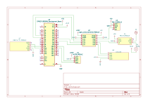

# Dự án STM32F103C8T6 – Giám sát nhiệt độ, độ ẩm và rò rỉ khí gas


## Giới thiệu

Đây là một dự án **Embedded Systems** sử dụng **STM32F103C8T6** làm vi điều khiển trung tâm để xây dựng hệ thống **giám sát nhiệt độ, độ ẩm và phát hiện rò rỉ khí gas**.

Firmware được phát triển bằng cách kết hợp **STM32CubeMX** để cấu hình phần cứng, ngoại vi và mã khởi tạo với **PlatformIO** để quản lý project, biên dịch và nạp firmware.

Hệ thống sử dụng:

* **AHT20** giao tiếp **I2C** để đo nhiệt độ và độ ẩm.
* **MQ-2** để phát hiện khí gas/khói và đưa tín hiệu cảnh báo về STM32.
* **LCD 16x2 giao tiếp I2C** để hiển thị nhiệt độ, độ ẩm và trạng thái cảnh báo.
* **Mạch chuyển mức logic 5V ↔ 3.3V** để bảo đảm tương thích mức điện áp giữa các thiết bị ngoại vi và STM32F103C8T6, đặc biệt trên các tín hiệu giao tiếp với LCD I2C và MQ-2.
* **Relay 5V** để điều khiển đèn cảnh báo **220V**.
* **UART** để truyền dữ liệu đo được từ STM32 lên PC.
* **Ứng dụng C# WinForms tự xây dựng** trên PC để hiển thị nhiệt độ, độ ẩm, trạng thái rò rỉ khí gas và đưa ra cảnh báo khi giá trị vượt ngưỡng cài đặt.

Mục tiêu của dự án là xây dựng một hệ thống giám sát thực tế, đồng thời thực hành các kỹ năng **STM32, I2C, GPIO, UART, điều khiển relay, xử lý ngưỡng cảnh báo và giao tiếp giữa MCU với phần mềm PC**.

---

## Video minh họa


https://github.com/user-attachments/assets/8e566ba1-eada-4bce-8f40-15832d237c19


---

## Sơ đồ nguyên lý



Sơ đồ nguyên lý thể hiện các khối chức năng chính của hệ thống:

* **STM32F103C8T6**: MCU trung tâm, thực hiện đọc cảm biến, xử lý điều kiện cảnh báo, điều khiển LCD, relay và truyền dữ liệu UART.
* **AHT20**: cảm biến nhiệt độ và độ ẩm, giao tiếp với STM32 thông qua I2C.
* **LCD 16x2 + module I2C**: hiển thị thông tin đo được và trạng thái cảnh báo.
* **MQ-2**: cảm biến dùng để phát hiện khí gas/khói; tín hiệu từ module được đưa qua mạch chuyển mức phù hợp trước khi vào MCU.
* **Mạch chuyển mức 5V ↔ 3.3V**: bảo đảm tương thích mức logic giữa STM32F103C8T6 và các ngoại vi sử dụng mức điện áp khác nhau, đặc biệt trên tuyến I2C của LCD và tín hiệu từ module MQ-2.
* **Relay 5V**: nhận tín hiệu điều khiển từ MCU để đóng/cắt đèn cảnh báo 220V.
* **USB–UART / UART**: cầu nối truyền dữ liệu giữa STM32 và PC.


## Thành phần phần cứng

| Thành phần | Số lượng | Vai trò |
| ------------------------------ | -------: | ----------------------------------------------- |
| STM32F103C8T6 | 1 | MCU trung tâm, xử lý dữ liệu và điều khiển hệ thống |
| AHT20 | 1 | Đo nhiệt độ và độ ẩm qua I2C |
| LCD 16x2 + module I2C | 1 | Hiển thị nhiệt độ, độ ẩm và cảnh báo |
| MQ-2 | 1 | Phát hiện khí gas/khói bằng ngõ ra số DO |
| Mạch chuyển mức 5V ↔ 3.3V | 1 | Tương thích mức logic giữa ngoại vi và STM32 |
| Relay 5V | 1 | Đóng/cắt tải cảnh báo |
| Đèn/tải 220V | 1 | Cảnh báo bằng tín hiệu đèn |
| USB–UART Converter | 1 | Cầu nối UART giữa STM32 và PC |
| PC / Laptop | 1 | Chạy ứng dụng WinForms để giám sát |

---

## Cấu hình giao tiếp và chân

> Một số chân GPIO phụ thuộc trực tiếp vào file cấu hình STM32CubeMX và project PlatformIO. Bảng dưới đây mô tả **chức năng giao tiếp**, còn số chân cụ thể nên lấy theo schematic/.ioc của phiên bản project đang sử dụng.

### AHT20 – STM32F103C8T6 (I2C)

| STM32 | Chức năng | AHT20 | Ghi chú |
| -------------------------------- | ------- | ----- | ------------------------------------------------ |
| **GPIO PB10** | I2C2 SCL | SCL | Đường xung clock của AHT20 |
| **GPIO PB11** | I2C2 SDA | SDA | Đường dữ liệu của AHT20 |
| 3.3V | Nguồn | VCC | Cấp nguồn theo thiết kế |
| GND | Mass | GND | **Bắt buộc nối chung** |

### LCD 16x2 – Module I2C – STM32

| STM32 / Bus | Chức năng | LCD I2C | Ghi chú |
| ---------------- | --------- | ------- | ------------------------------------------ |
| **GPIO PB6** | I2C1 SDA | SDA | Đường dữ liệu LCD, đi qua mạch chuyển mức |
| **GPIO PB7** | I2C1 SCL | SCL | Đường clock LCD, đi qua mạch chuyển mức |
| GND | Mass | GND | **Bắt buộc nối chung ở phía logic** |
| 5V | Nguồn LCD | VCC | Theo thiết kế phần cứng của module LCD |

### MQ-2 – STM32F103C8T6

| Tín hiệu | Chức năng | Kết nối MCU | Ghi chú |
| -------- | --------- | ----------- | ---------------------------------------------- |
| **DO** | Digital Output | **GPIO PA3** | Firmware đọc trạng thái số để xác định cảnh báo gas; tín hiệu phải phù hợp mức 3.3V trước khi vào MCU |
| VCC | Nguồn | 5V | Theo module MQ-2 |
| GND | Mass | GND | Nối chung với hệ thống |

> Trong project này, cảm biến MQ-2 được sử dụng thông qua ngõ ra số DO, không sử dụng ADC để đo hoặc tính toán nồng độ khí gas. Module MQ-2 được cấp nguồn 5V, do đó tín hiệu DO cần được đưa qua mạch chuyển mức logic/giảm áp trước khi kết nối với GPIO 3.3V của STM32F103C8T6.

> Về trạng thái tín hiệu, DO = 1 khi chưa phát hiện khí gas vượt ngưỡng cài đặt và DO = 0 khi phát hiện nồng độ khí vượt ngưỡng. Ngưỡng cảnh báo có thể được điều chỉnh bằng biến trở trên module MQ-2.

### Relay 5V – STM32F103C8T6

| Tín hiệu | Chức năng | MCU | Ghi chú |
| -------- | --------- | --- | -------------------------------------------- |
| **RELAY_CTRL** | Điều khiển relay | **GPIO PA4** | Firmware đặt mức HIGH khi có cảnh báo |
| VCC | Nguồn relay | 5V | Cấp nguồn theo module relay |
| GND | Mass | GND | Nối chung phía điều khiển |

Relay được sử dụng để đóng/cắt đèn cảnh báo **220V**.

> **Cảnh báo an toàn:** phần tải 220V phải được cách ly và đấu nối đúng kỹ thuật. Không thao tác phần điện lưới khi đang cấp điện; ưu tiên sử dụng hộp bảo vệ, cầu chì/bảo vệ quá dòng và khoảng cách cách điện phù hợp.

### UART – STM32 ↔ PC

| STM32 | Chức năng | USB–UART Converter | Mục đích |
| -------- | ------- | ------------------ | -------------------------------- |
| GPIO PA9 | Transmit | RX | STM32 gửi dữ liệu lên PC |
| GPIO PA10 | Receive | TX | STM32 nhận dữ liệu từ PC nếu cần |
| GND | Mass | GND | **Bắt buộc nối chung** |

---

## Hệ thống giám sát và cảnh báo — phần trọng tâm của dự án

Mỗi chu kỳ hoạt động, firmware thực hiện việc đọc dữ liệu từ cảm biến, cập nhật LCD, kiểm tra các điều kiện cảnh báo, điều khiển relay/đèn và truyền dữ liệu lên PC.

### 1. Đọc nhiệt độ và độ ẩm từ AHT20

AHT20 giao tiếp với STM32F103C8T6 thông qua **I2C**.

Firmware khởi tạo AHT20 bằng `AHT20_Init()`, sau đó gọi `AHT20_Read(&temperature, &humidity)` để lấy nhiệt độ và độ ẩm. Hai giá trị này được dùng cho hiển thị LCD, xử lý cảnh báo và truyền UART.

Các giá trị này được sử dụng đồng thời cho **LCD tại thiết bị** và **ứng dụng WinForms trên PC**.

### 2. Phát hiện rò rỉ khí gas bằng MQ-2

MQ-2 được sử dụng ở **ngõ ra số DO** và firmware đọc trạng thái tại **GPIO PA3** bằng `HAL_GPIO_ReadPin()`. Project hiện tại dùng trạng thái số để cảnh báo, không tính nồng độ ppm bằng ADC.

Khi `PA3 == GPIO_PIN_SET`, firmware xử lý đây là trạng thái cảnh báo gas:

* LCD hiển thị **`CANH BAO` / `RO RI KHI GA`**.
* GPIO **PA4** được đặt mức HIGH để kích **relay 5V** và đèn cảnh báo 220V.
* Trạng thái gas được truyền lên PC dưới trường `G` trong khung UART.
* Ứng dụng WinForms hiển thị trạng thái và cảnh báo tương ứng.

> Ngưỡng phát hiện thực tế của MQ-2 phụ thuộc module, mạch, thời gian làm nóng và cách hiệu chỉnh cảm biến. Vì vậy trạng thái **DO** trong project được xem là **tín hiệu cảnh báo theo cấu hình phần cứng**, không phải giá trị nồng độ ppm tuyệt đối.

### 3. Cảnh báo nhiệt độ vượt ngưỡng

Trong firmware hiện tại, hệ thống sử dụng hai ngưỡng môi trường:

* **Nhiệt độ > 35.0°C** → cảnh báo nhiệt độ cao.
* **Độ ẩm > 95.0%RH** → cảnh báo độ ẩm cao.

Khi một trong các điều kiện trên xảy ra, relay được kích hoạt và LCD chuyển sang màn hình cảnh báo tương ứng.

Ví dụ:

```text
Nhiệt độ / Độ ẩm vượt ngưỡng
              │
              ▼
       Kích hoạt cảnh báo
              │
        ┌─────┴─────┐
        ▼           ▼
   LCD cảnh báo   Relay / đèn
```

Firmware kiểm tra các điều kiện theo thứ tự **gas → nhiệt độ → độ ẩm**. Do đó, khi đồng thời có nhiều điều kiện cảnh báo, thông báo gas được ưu tiên hiển thị trước.

### 4. Hiển thị LCD 16x2

LCD được sử dụng để cung cấp thông tin trực tiếp tại thiết bị, giúp hệ thống có thể hoạt động mà không cần theo dõi PC liên tục.

Nội dung hiển thị được tổ chức theo các trạng thái. Khi hệ thống bình thường, firmware hiển thị:

```text
+----------------+
| NHIET: 28.50 C |
| DO AM: 65.20 % |
+----------------+
```

Khi có sự cố, LCD chuyển sang thông báo cảnh báo:

```text
+----------------+
| CANH BAO      |
| RO RI KHI GA  |
+----------------+
```

### 5. Điều khiển relay và đèn cảnh báo 220V

STM32 xuất tín hiệu điều khiển tại **GPIO PA4** tới relay 5V. Trong firmware, PA4 được đặt **HIGH** khi có cảnh báo và **LOW** khi hệ thống bình thường.

Luồng điều khiển:

```text
Điều kiện cảnh báo
        │
        ▼
 STM32F103C8T6
        │
        ▼
 RELAY_CTRL(GPIO PA4)
        │
        ▼
   Relay 5V
        │
        ▼
   Đèn / tải 220V
```

Phần MCU chỉ xử lý tín hiệu điều khiển điện áp thấp; tải 220V phải được bố trí và cách ly phù hợp với thiết kế phần cứng.

### 6. Truyền dữ liệu UART lên PC

STM32 truyền dữ liệu giám sát tới ứng dụng WinForms thông qua UART.

Firmware hiện tại tạo khung dữ liệu UART theo định dạng:

```text
@ T=%.2f H=%.2f G=%d &
```

Ví dụ:

```text
@ T=28.50 H=65.20 G=0 &
```

Trong đó:

* `T` — nhiệt độ hiện tại.
* `H` — độ ẩm hiện tại.
* `G` — trạng thái gas đọc từ GPIO PA3 (`0` hoặc `1`).

Khung dữ liệu được gửi sau mỗi chu kỳ **1 giây**.

---

## Ứng dụng WinForms trên PC

Ứng dụng **C# WinForms** được tự xây dựng để làm giao diện giám sát phía PC.

Các chức năng chính:

* Kết nối tới cổng COM của STM32 thông qua USB–UART.
* Nhận dữ liệu UART theo thời gian thực.
* Hiển thị **nhiệt độ** và **độ ẩm**.
* Hiển thị trạng thái **rò rỉ khí gas**.
* Hiển thị trạng thái **cảnh báo**.
* Cảnh báo khi nhiệt độ vượt **35°C**.
* Cảnh báo khi độ ẩm vượt **95%RH**.
* Cảnh báo khi MQ-2 báo trạng thái gas.

Kiến trúc giao tiếp tổng quát:

```text
┌─────────────────────────┐
│      STM32F103C8T6      │
│                         │
│ AHT20 ── I2C2 ─┐        │
│ MQ-2 ── GPIO ──┤        │
│                │        │
│ LCD ── I2C1 ───┤        │
│ Relay ─ GPIO ──┤        │
│                │        │
│        UART ───┴────────┼────────┐
└─────────────────────────┘        │
                                   ▼
                        ┌──────────────────────┐
                        │      USB–UART        │
                        └──────────┬───────────┘
                                   │
                                   ▼
                        ┌──────────────────────┐
                        │    C# WinForms       │
                        │                      │
                        │ - Nhiệt độ           │
                        │ - Độ ẩm              │
                        │ - Rò rỉ khí gas      │
                        │ - Cảnh báo            │
                        └──────────────────────┘
```

---

## Kiến trúc hệ thống tổng quan

```text
                           ┌──────────────────────┐
                           │      PC / Laptop     │
                           │     C# WinForms      │
                           └──────────┬───────────┘
                                      │
                                      │ UART
                                      ▼
┌─────────────────────────────────────────────────────────┐
│                   STM32F103C8T6                         │
│                                                         │
│  ┌─────────────┐       ┌────────────────────────────┐  │
│  │    AHT20    │◄──I2C─┤ Đọc nhiệt độ + độ ẩm      │  │
│  └─────────────┘       └──────────────┬─────────────┘  │
│                                       │                │
│  ┌─────────────┐                      ▼                │
│  │    MQ-2     │──GPIO──►     Xử lý ngưỡng cảnh báo   │
│  └─────────────┘                      │                │
│                                       ├────► LCD 16x2 │
│  ┌─────────────┐                      │       (I2C)   │
│  │ Mạch chuyển │◄──── 5V ↔ 3.3V ────┤                │
│  │ mức logic   │                      ├────► Relay 5V │
│  └─────────────┘                      │                │
│                                       └────► UART ─────┼──► PC
└─────────────────────────────────────────────────────────┘
                                                  │
                                                  ▼
                                         ┌────────────────┐
                                         │  Đèn / tải     │
                                         │      220V      │
                                         └────────────────┘
```

### Quy trình hoạt động

1. **Khởi tạo:** STM32F103C8T6 khởi tạo GPIO, I2C1, I2C2 và USART1; sau đó gọi `AHT20_Init()` và `LCD_I2C_Init()`.
2. **Đọc cảm biến:** STM32 đọc nhiệt độ/độ ẩm từ AHT20 và đọc trạng thái số của MQ-2 tại **PA3**.
3. **Xử lý cảnh báo:** firmware kiểm tra theo thứ tự **gas → nhiệt độ > 35°C → độ ẩm > 95%RH**.
4. **Hiển thị tại thiết bị:** LCD 16x2 hiển thị thông báo cảnh báo hoặc nhiệt độ, độ ẩm khi hệ thống bình thường.
5. **Điều khiển cảnh báo:** GPIO **PA4** được đặt HIGH khi có cảnh báo để kích relay 5V; khi bình thường PA4 được đặt LOW.
6. **Truyền dữ liệu:** USART1 gửi khung `@ T=... H=... G=... &` lên PC.
7. **Chu kỳ:** sau mỗi vòng xử lý, firmware chờ `HAL_Delay(1000)` trước lần đọc tiếp theo.

---

## Bắt đầu

### Yêu cầu phần mềm

| Phần mềm | Phiên bản | Mục đích |
| -------------------------------- | --------- | ----------------------------------------------- |
| STM32CubeMX | Theo phiên bản project | Cấu hình MCU, GPIO, I2C1, I2C2, USART1 và sinh mã khởi tạo |
| PlatformIO | Mới nhất | Quản lý project, biên dịch và nạp firmware |
| VS Code | Khuyến nghị | Môi trường phát triển cho PlatformIO |
| STM32Cube HAL | Theo project | Thư viện HAL sử dụng trong firmware |
| C# / .NET WinForms | Theo project | Phát triển ứng dụng giám sát trên PC |
| ST-LINK Utility / STM32CubeProgrammer | Theo môi trường sử dụng | Nạp và kiểm tra firmware |
| Serial Terminal | Bất kỳ | Kiểm thử UART và debug |

### Lắp phần cứng

* Kết nối **AHT20** với bus I2C của STM32.
* Kết nối **LCD 16x2 I2C** qua mạch chuyển mức logic nếu module hoạt động ở 5V.
* Kết nối **MQ-2** theo thiết kế; nếu tín hiệu đưa vào MCU là tín hiệu 5V thì phải chuyển mức/giảm áp về mức phù hợp với STM32.
* Kết nối **Relay 5V** với chân điều khiển của MCU thông qua mạch driver phù hợp với tải của relay.
* Kết nối tải/đèn **220V** vào tiếp điểm relay theo đúng thiết kế điện và yêu cầu an toàn.
* Kết nối **UART của STM32** với USB–UART Converter để giao tiếp với PC.
* Nối chung GND ở phía mạch logic theo thiết kế.

### Cài đặt

1. Sao chép repository:

```bash
git clone <repository-url>
cd <repository-folder>
```

2. Mở thư mục project bằng **Visual Studio Code + PlatformIO**.

3. Kiểm tra cấu hình trong `platformio.ini` và bảo đảm board STM32F103C8T6 đúng với project.

4. Đối chiếu cấu hình GPIO/I2C/UART với file cấu hình **STM32CubeMX** và schematic.

5. Biên dịch firmware:

```bash
pio run
```

6. Nạp firmware bằng ST-LINK hoặc phương thức upload được cấu hình trong `platformio.ini`:

```bash
pio run -t upload
```

7. Kết nối USB–UART với PC và xác định đúng cổng COM.

8. Mở ứng dụng WinForms.

9. Khởi động hệ thống và kiểm tra dữ liệu nhiệt độ, độ ẩm, trạng thái MQ-2 và cảnh báo.

### Kiểm thử hệ thống

Các nội dung cần kiểm tra:

* STM32F103C8T6 khởi động bình thường.
* AHT20 trả về dữ liệu nhiệt độ và độ ẩm hợp lệ.
* LCD 16x2 hiển thị đúng nội dung.
* Mạch chuyển mức 5V ↔ 3.3V hoạt động ổn định trên các đường tín hiệu cần thiết.
* MQ-2 thay đổi trạng thái khi xuất hiện điều kiện phát hiện khí theo cấu hình module.
* Relay 5V đóng/cắt đúng theo tín hiệu điều khiển.
* Đèn/tải 220V hoạt động đúng theo relay.
* UART truyền dữ liệu ổn định lên PC.
* WinForms nhận và hiển thị dữ liệu đúng.
* Cảnh báo xuất hiện khi **temperature > 35.0°C**.
* Cảnh báo xuất hiện khi **humidity > 95.0%RH**.
* Cảnh báo xuất hiện khi **MQ-2 DO = HIGH**.

---

## Cấu trúc project đề xuất

```text
.
├── firmware/
│   ├── include/
│   ├── lib/
│   ├── src/
│   ├── test/
│   └── platformio.ini
│
├── cube_mx/
│   └── *.ioc
│
├── pc_app/
│   └── WinForms project
│
├── demo/
│   ├── Schematic.svg
│   ├── PCB.svg
│   └── ...
│
└── README.md
```

> Cấu trúc trên mang tính mô tả; tên thư mục thực tế cần giữ đúng theo repository hiện tại của dự án.

---

## Tài liệu tham khảo

* [Datasheet STM32F103C8](https://www.st.com/resource/en/datasheet/stm32f103c8.pdf)
* [STM32CubeMX](https://www.st.com/en/development-tools/stm32cubemx.html)
* [PlatformIO Documentation](https://docs.platformio.org/)
* [AHT20 Datasheet](https://www.aosong.com/userfiles/files/media/AHT20%20datasheet%20Version-1.0.pdf)
* [Microsoft .NET](https://learn.microsoft.com/en-us/dotnet/)
* [Windows Forms](https://learn.microsoft.com/en-us/dotnet/desktop/winforms/)

---

## Trạng thái dự án

* **Trạng thái:** Hoàn thành
* **Phiên bản:** v1.0
* **Cập nhật lần cuối:** Tháng 9/2026

---

## Liên hệ

**Gia Bảo**

📧 Email: *[your-email@example.com](mailto:your-email@example.com)*  
🐙 GitHub: *your-github-profile*
